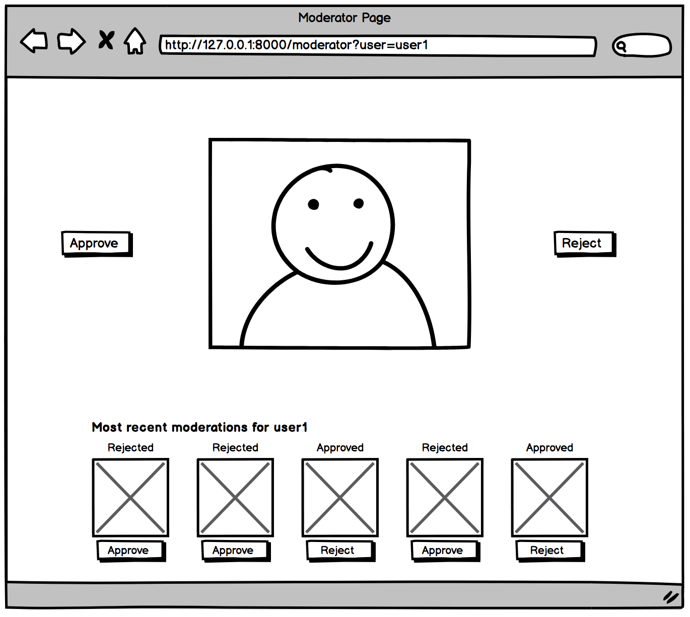
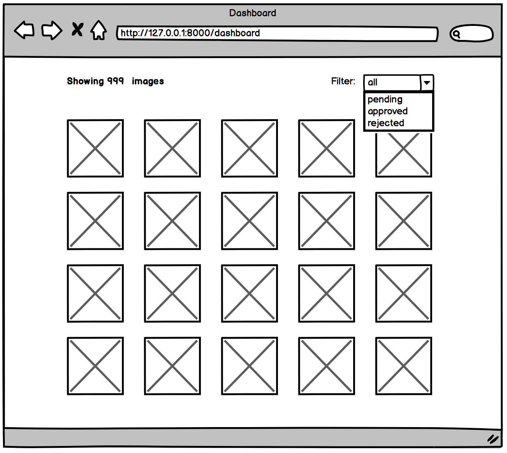

# Challenge

Build a thumbs-up/thumbs-down image moderation service.

## Requirements
 - fast as possible
 - minimize time making decision
 - minimize wasted moderations
 - allow

### Pages

make dashboard first.
features:
show all images based on filter: all, pending, approved, rejected
figure out how to use redux here.
I can poll the images url every 10 seconds and if the state changed then it will update the view.
I can limit this to 20 and don't do lazy loading, no time and may not be needed.
seems the dashboard can show approved and disapproved in something visual.

* Show the size of the filtered set of images currently being viewed.
hover over image to show larger image and some stats:
* Optional: Show some statistics, e.g. the average time spent in queue, number of moderators active, or whatever you think might be useful to the administrator.

moderator:

needs ?user=user1 or user2
need a data model
current image displayed is next image in the queue.
watch for race condition but don't show same image to same user.

GET images/{filter}   all, pending, rejected, approved
** maybe add user=user1 to querystring.
GET image/{id} to show the individual image in a popup. {id is url, since db has no id field}

GET

We want to start with a prototype that has just two pages. The real system will require moderators to login before they can start work, but for now we can just do something hacky like put `?user=user1` or `?user=user2` in the URL to save time.

#### /moderator

This is the page where moderators will approve/reject images. It should appear as follows:

* When the queue is not empty:
  * Show the image to be reviewed with approve/reject buttons

* When the queue is empty:
  * Show message saying the queue is empty.

* Always:
  * Show this moderator's past 5 moderations with buttons to toggle their decision (so they can undo a mistake)
  * Possible to use keyboard-only for all interactions

Example Layout:

#### /dashboard

This is the page where we can see the state of the system, how well the moderators are performing, etc.

* Show all the images the system knows about.
* Filter by: all, pending, approved, rejected.
* Sort by: time the image entered the system.
* Show the size of the filtered set of images currently being viewed.
* Optional: Show some statistics, e.g. the average time spent in queue, number of moderators active, or whatever you think might be useful to the administrator.

Example Layout:

## Test Dataset

You can use this [CSV of test data](https://d3ous0vnp05zqm.cloudfront.net/manual_uploads/moderation_challenge/images.csv) to build your service. It's a two-column CSV. The first column is the timestamp when the image was added to the system. The second column is the image URL.

## Deliverables

* Python or JavaScript app (any framework)
* Quick and easy to get running locally on Linux or OSX
* Any docs required for operating

## Tips

* Write readable, quality code.
* Styling is not important.
* Include tests if you want to.
* Include commit history if you want to.
